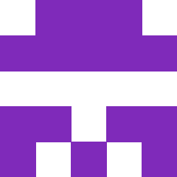

# Idicon
generate an identicon for a string

5x5 grid of squares 250px x 250px and mirror about the center  
Found people doing this online and wanted to try it out myself, pretty cool. I will added a dark mode later!

